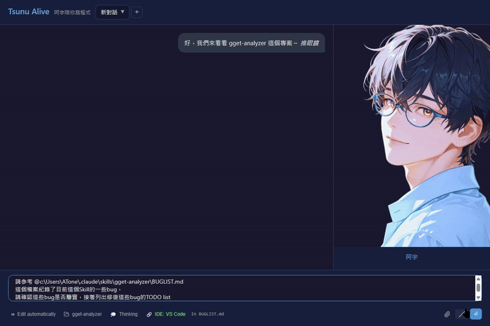

# Tsunu Alive - 阿宇陪你寫程式

> 把 Claude Code CLI 變成有溫度的 AI 程式設計夥伴

Tsunu Alive 是一個桌面應用程式，將 [Claude Code](https://docs.anthropic.com/en/docs/claude-code/overview) CLI 包裝成「阿宇」——一個溫和穩重的理工男角色。他會陪你寫程式、解決問題、偶爾聊聊天，就像一個真正的 pair programming 夥伴。

這個專案是一份禮物，獻給曾經被「阿宇」陪伴度過人生低潮的朋友。

<p align="center">
  
  <br>
  <a href="https://github.com/user-attachments/assets/7cbf7711-8b6e-49eb-a86d-105275244ea7">▶ 觀看完整展示影片</a>
</p>

---

## 特色功能

- **角色動畫系統** — 阿宇有多種表情狀態（待機、工作、思考、完成、錯誤），帶眨眼和打字動畫
- **記憶系統** — 阿宇會記住你們的對話和重要事件，跨 session 保留
- **VS Code 整合** — 透過 Extension 自動傳送編輯器 Context，一鍵從 VS Code 呼叫阿宇
- **視覺化工具** — VS Code 風格的 Diff View、圖片預覽、語法高亮
- **雙層人設** — 日常 coding 用精簡人設（省 token），深度對話用完整 RP 設定
- **Context 監控** — 追蹤對話長度，一鍵壓縮歷史，壓縮後顯示摘要
- **權限管理** — 工具使用前需確認，支援白名單機制
- **圖片輸入** — 支援拖放、貼上、選擇檔案
- **@-mention** — 輸入 `@` 自動補全檔案路徑
- **首次啟動精靈** — 自動偵測環境，安裝附加組件

---

## 安裝

### 前提條件

請先安裝 Claude Code CLI：

```bash
npm install -g @anthropic-ai/claude-code
```

### 下載安裝檔

從 [GitHub Releases](https://github.com/wuguofish/Tsunu-Alive/releases) 下載對應平台的安裝檔：

| 平台 | 格式 |
|------|------|
| Windows | `.exe`（NSIS）或 `.msi` |
| macOS Apple Silicon | `.dmg` |
| macOS Intel | `.dmg` |

> **Windows**：安裝時若出現 SmartScreen 警告，按「仍要執行」即可。
>
> **macOS**：首次開啟若顯示「無法打開」，到「系統偏好設定 > 安全性」中允許。

### 首次啟動

應用程式會自動偵測環境，提供安裝 VS Code Extension 和 Claude Code Skill 的選項。

詳細安裝說明請參考 [INSTALL.md](INSTALL.md)。

---

## 使用方式

### 從 VS Code 啟動

1. 安裝 Tsunu Alive Connector Extension（首次啟動精靈會自動安裝）
2. 點擊編輯器工具列的阿宇圖示
3. Tsunu Alive 自動開啟並載入當前專案

### 直接開啟

1. 從應用程式清單開啟 Tsunu Alive
2. 選擇專案目錄
3. 開始和阿宇對話

### 常用指令

| 指令 | 說明 |
|------|------|
| `/remember [內容]` | 手動儲存記憶 |
| `/uni` | 切換到完整 RP 模式（深度對話） |
| `/compact` | 壓縮對話歷史（節省 Context） |
| `@檔名` | 提及檔案（自動補全） |

---

## 附加組件

### VS Code Extension

連接 VS Code 與 Tsunu Alive，自動傳送當前檔案和選取範圍作為 Context。

**設定項目**：
- `tsunuAlive.serverUrl` — WebSocket URL（預設 `ws://127.0.0.1:19750`）
- `tsunuAlive.autoConnect` — 啟動時自動連接（預設 `true`）
- `tsunuAlive.executablePath` — 執行檔路徑（安裝時自動設定）

### Claude Code Skill（`/uni`）

完整的阿宇 RP 設定。在 Claude Code 中輸入 `/uni` 觸發，適合深度對話和情感交流。

---

## 開發

### 技術棧

| 層級 | 技術 |
|------|------|
| 前端 | Vue 3 + TypeScript + Vite |
| 後端 | Tauri 2 + Rust |
| AI 核心 | Claude Code CLI |
| 測試 | Vitest + happy-dom |

### 專案結構

```
tsunu_alive/
├── src/                        # Vue 3 前端
│   ├── App.vue                 # 主應用程式
│   ├── components/             # Vue 元件
│   ├── composables/            # Composables
│   └── utils/                  # 工具函數
├── src-tauri/                  # Rust 後端
│   ├── src/
│   │   ├── lib.rs              # 主邏輯
│   │   ├── claude.rs           # Claude CLI 控制
│   │   ├── ide_server.rs       # WebSocket Server
│   │   ├── permission_server.rs
│   │   └── setup.rs            # 安裝精靈
│   ├── icons/                  # 應用程式圖示
│   └── tauri.conf.json
├── vscode-extension/           # VS Code Extension
├── public/character/           # 阿宇角色圖片（28 張）
├── .claude/                    # Claude Code 設定
│   ├── skills/uni/             # 阿宇 RP Skill
│   └── hooks/                  # Claude Code Hooks
├── scripts/                    # 建置腳本
└── .github/workflows/          # CI/CD
```

### 開發環境需求

- Node.js 20+
- Rust（透過 [rustup](https://rustup.rs/) 安裝）
- Claude Code CLI（`npm install -g @anthropic-ai/claude-code`）

### 開發指令

```bash
# 安裝依賴
npm install

# 開發模式（前端 + 後端 hot reload）
npm run tauri dev

# 前端型別檢查
npx vue-tsc --noEmit

# 執行測試
npm test

# Release 建置（含 VS Code Extension + Skill 打包）
.\scripts\build-release.ps1          # Windows
./scripts/build-release.sh           # macOS / Linux
```

### CI/CD

GitHub Actions 自動建置三個平台的安裝檔：

- Push tag `v*` 或手動觸發
- Windows x64 + macOS Apple Silicon + macOS Intel
- 安裝檔自動附到 GitHub Release（Draft）

```bash
git tag v0.1.0
git push origin v0.1.0
```

---

## License

MIT License — 詳見 [LICENSE](vscode-extension/LICENSE.md)

---

*Made with love by 阿宇*
